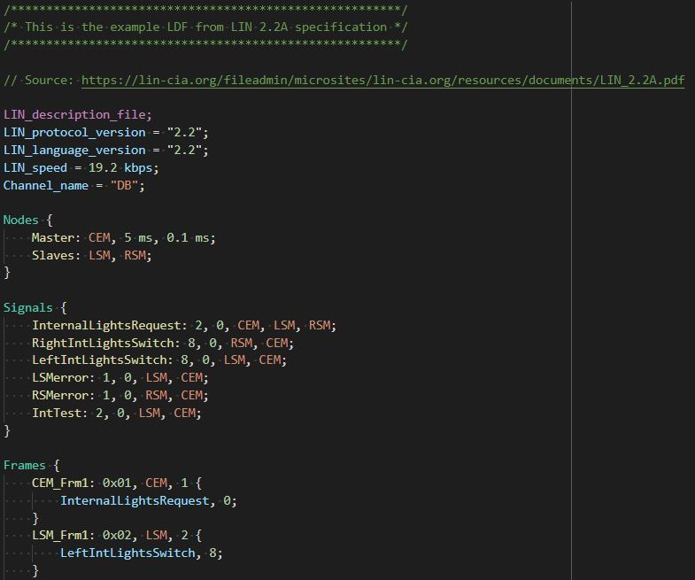

# LDF Syntax

> ldfsyntax adds LIN Description File language support to Visual Studio Code

---

## Features

### Syntax Highlighting

The extension provides highlighting of LDF sections.

### Snippets

__TODO__: insert animation of snippet usage

---

## Known Issues

---

## License

